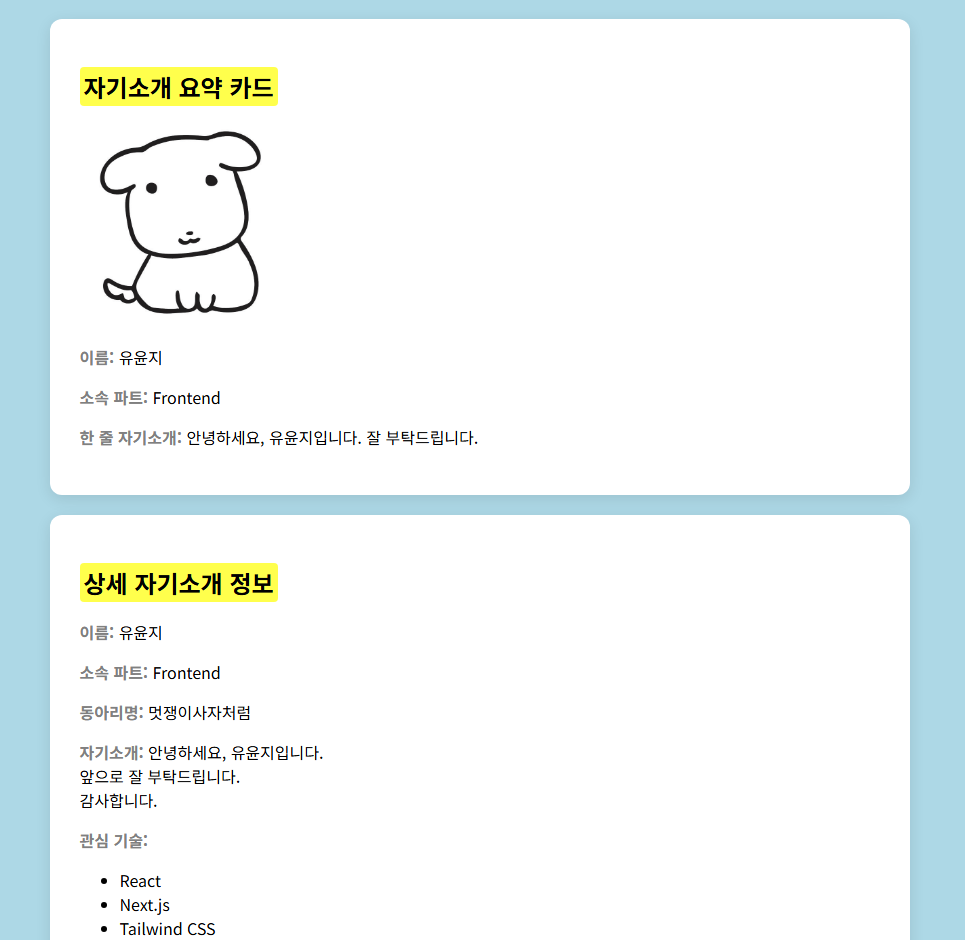

# 📘 Today I Learned

### 1. 오늘 배운 내용
- html, css 기초

### 2. 핵심 정리 (내 언어로)
- img 를 활용해 html에서 이미지를 삽입할 수 있다.
- span 을 활용해 텍스트에 효과를 줄 수 있다.
- ul 및 li 를 활용해 불렛 포인트 목록을 만들 수 있다.

### 3. 결과 이미지(스크린샷)
-

### 4. 느낀 점
- 자주 사용하지 않아 많이 잊어버렸던 코드 사용법을 다시 공부할 수 있어 좋았습니다.