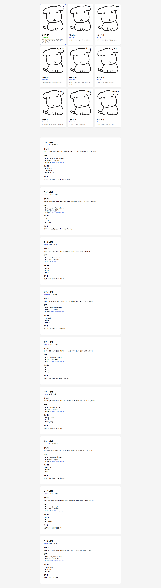

# 📘 Today I Learned

### 1. 오늘 배운 내용
- CSS Grid와 Flexbox를 활용한 레이아웃 설계
- Position 속성을 이용한 요소 배치
- 미디어 쿼리를 활용한 반응형 웹페이지 구현

### 2. 핵심 정리 (내 언어로)
- Grid를 사용해 전체적인 카드 배치를 조절할 수 있다.
- Flexbox를 사용해 카드 내부의 요소들을 세로로 정렬할 수 있다.
- Position absolute를 활용해 이미지 위에 배지를 겹쳐서 올릴 수 있다.
- Media Query를 활용해 화면 너비에 따라 레이아웃을 동적으로 변경할 수 있다.

### 3. 결과 이미지(스크린샷)

### 4. 느낀 점
- 반응형 웹페이지 구현 방법을 다시 학습할 수 있어 유익했습니다.
