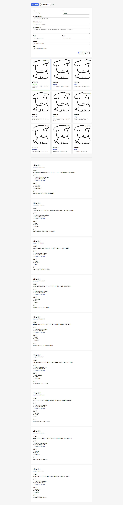

# 📘 Today I Learned

### 1. 오늘 배운 내용
- JavaScript를 활용한 DOM 조작 (요소 추가 / 삭제 / 갱신)
- 이벤트 리스너(`addEventListener`)를 이용한 사용자 인터랙션 처리
- HTML `data-*` 속성을 읽어 JavaScript 배열로 초기화하는 방법
- 배열 데이터와 DOM을 동기화하는 렌더링 패턴

### 2. 핵심 정리 (내 언어로)
- `querySelectorAll`로 하드코딩된 HTML 카드 목록을 읽고, `dataset`으로 각 카드의 데이터를 뽑아 JS 배열을 만들 수 있다.
- 배열에 항목을 추가(`push`)하거나 제거(`pop`)한 뒤 화면을 다시 그리면, 데이터와 DOM이 항상 일치하게 유지된다.
- 이벤트 등록은 HTML에 `onclick`을 쓰지 않고 `addEventListener`만 사용했다.

### 3. 결과 이미지(스크린샷)
- 

### 4. 느낀 점
- HTML을 읽어서 배열을 초기화하는 방식이 실제로 쓸 일이 있을지 잘 모르겠다.