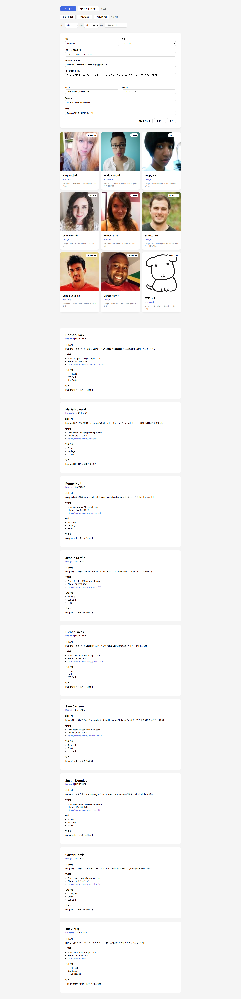

# 📘 Today I Learned

### 1. 오늘 배운 내용
- fetch를 사용해 외부 API 데이터를 불러오고 상태에 반영하는 방법
- 비동기 요청의 로딩/성공/실패 상태를 useState로 관리하는 방법
- 필터, 정렬, 검색 조건을 상태로 관리하고 화면에 실시간 반영하는 방법
- 관련 로직을 Custom Hook과 유틸 함수로 분리하는 방법

### 2. 핵심 정리 (내 언어로)
- 이전 주차에서 HTML data-* 속성에 하드코딩했던 데이터를 lions.js 파일로 분리해 관리할 수 있다.

### 3. 결과 이미지(스크린샷)

### 4. 느낀 점
- HTML/JS로 작성하던 코드를 React 컴포넌트 구조로 옮겨보며 데이터와 UI를 분리해서 관리하는 방식을 익힐 수 있었습니다.