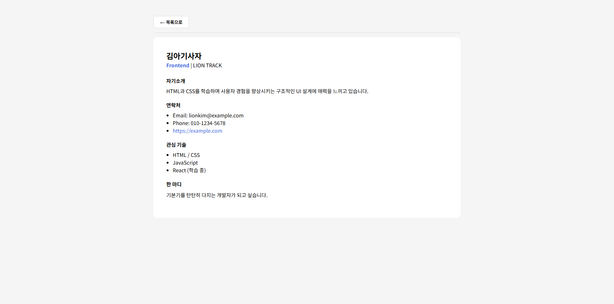

# 📘 Today I Learned

### 1. 오늘 배운 내용
- react-router-dom을 사용해 SPA 방식으로 페이지 간 이동을 구현하는 방법
- URL 쿼리 파라미터로 필터/정렬/검색 상태를 관리하고 직접 접속 시에도 복원하는 방법
- 여러 페이지에서 공유해야 하는 상태를 상위 컴포넌트에서 관리하고 props로 전달하는 방법
- 페이지 단위 컴포넌트를 pages/ 디렉토리로 분리하는 방법

### 2. 핵심 정리 (내 언어로)
- 이전 주차에서 컴포넌트 내부 useState로 관리하던 필터/정렬/검색 상태를 URL 쿼리 파라미터로 옮기면, 해당 URL로 직접 접속해도 동일한 화면을 볼 수 있다.

### 3. 결과 이미지(스크린샷)

### 4. 느낀 점
- 상태를 URL에 담는다는 개념에 있어 링크를 공유하거나 새로고침해도 같은 화면이 유지된다는 점에서 왜 사용하는지 이해할 수 있었습니다.